<div align="center">

# 🏠 Mumbai Real Estate Intelligence Platform

### AI Powered Property Valuation, Investment Analytics, Explainable AI and Locality Intelligence


# 🚀 Live Demo

The project is deployed and fully functional.

🔗 Streamlit App:  
https://mumbai-real-estate-intelligence-platform.streamlit.app/

🔗 Power BI Dashboard:  
https://app.powerbi.com/links/7UxEQBbDjd?ctid=c274dbc2-fb53-4037-8d76-f7f8315c5ff2&pbi_source=linkShare

### Predict • Explain • Analyze • Invest

## ✨ Key Features

 - AI-powered Mumbai property price prediction
 - SHAP-based explainable AI insights
 - Investment locality recommendation engine
 - Generative AI real-estate assistant
 - Interactive Streamlit dashboard
 - Power BI business intelligence reports
 - Market KPI tracking and analytics

</div>

# 🎯 Problem Statement

Mumbai is one of the most expensive and dynamic real estate markets in India.

Property buyers and investors often face challenges such as:

- Lack of transparent pricing
- Difficulty comparing localities
- No explainability behind property valuation
- Limited investment intelligence
- Fragmented market insights

This project solves these challenges using Machine Learning,
Explainable AI and Business Intelligence dashboards.

# 🎯 Problem Statement

Mumbai is one of the most expensive and dynamic real estate markets in India.

Property buyers and investors often face challenges such as:

- Lack of transparent pricing
- Difficulty comparing localities
- No explainability behind property valuation
- Limited investment intelligence
- Fragmented market insights

This project solves these challenges using Machine Learning,
Explainable AI and Business Intelligence dashboards.

# 🏗️ Architecture

Raw Data
    ↓
Data Cleaning
    ↓
Feature Engineering
    ↓
LightGBM Model Training
    ↓
SHAP Explainability
    ↓
Prediction Engine
    ↓
Recommendation Engine
    ↓
AI Assistant
    ↓
Streamlit Dashboard
    ↓
Power BI Dashboard

# 📸 Streamlit Dashboard

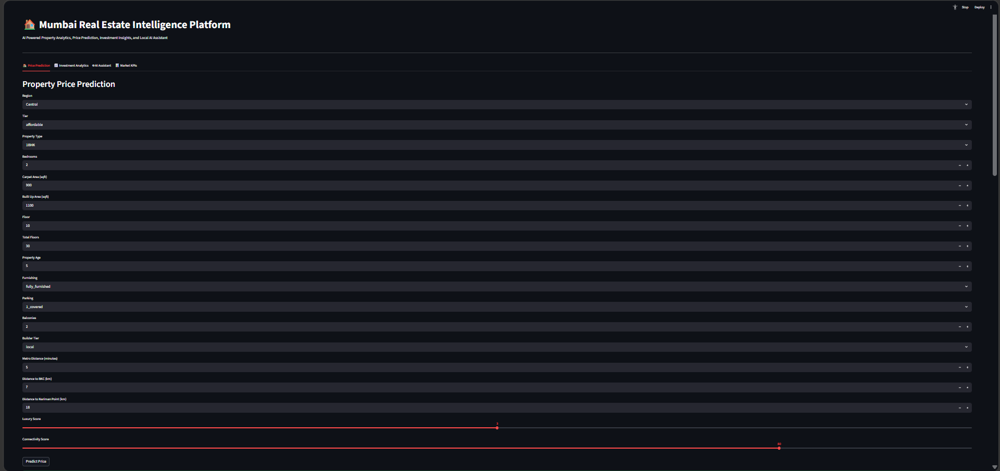
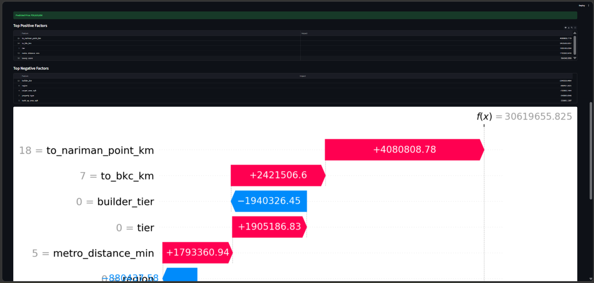
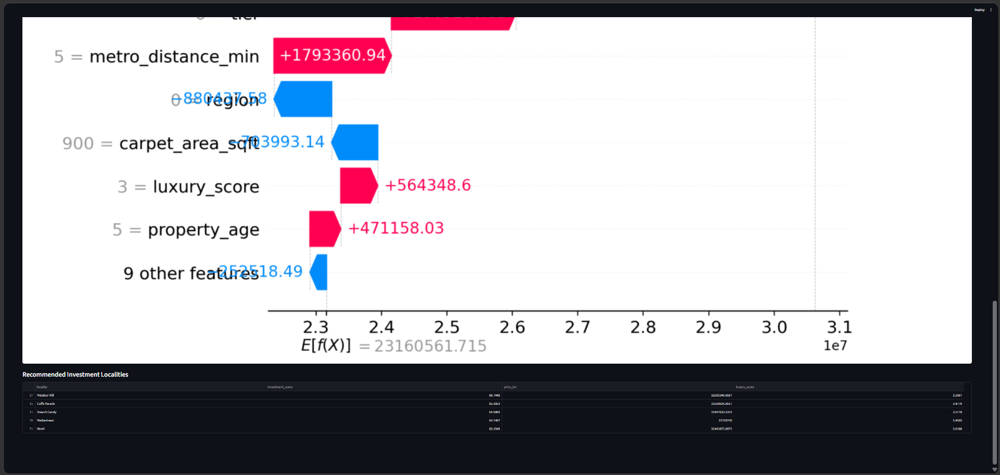
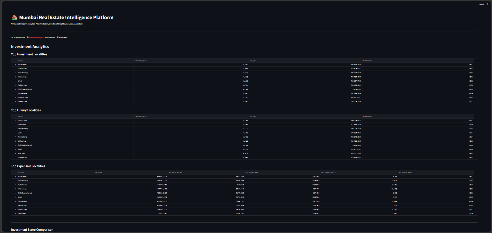
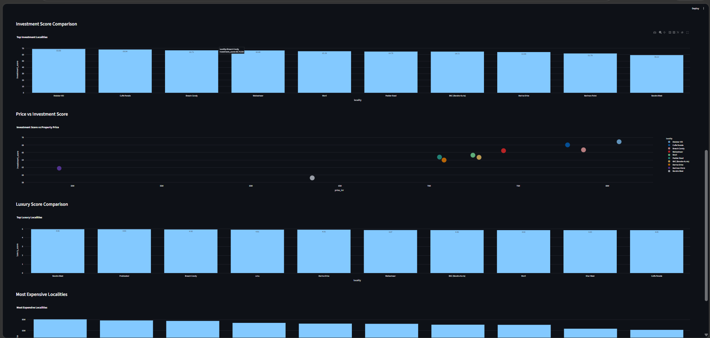
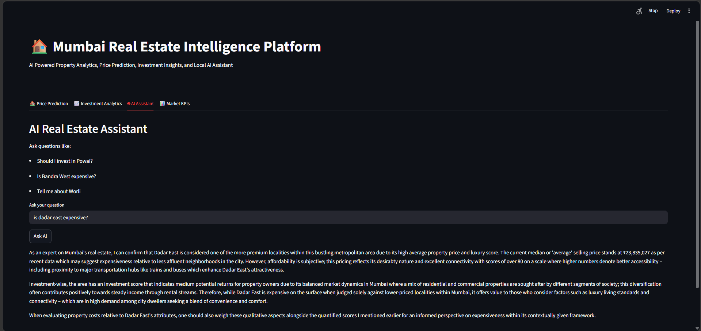
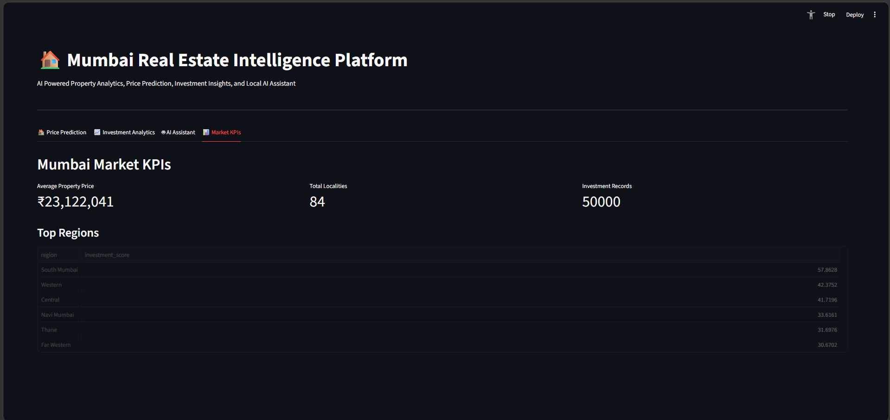

# 📊 Power BI Analytics Dashboard

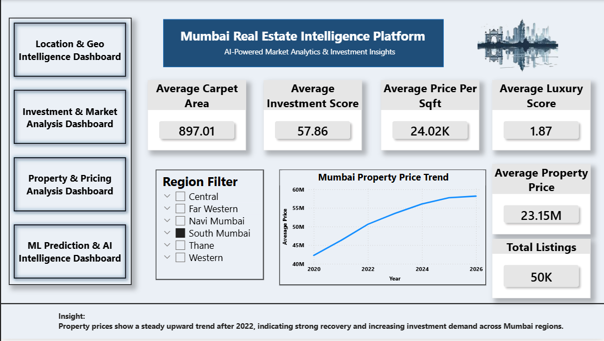
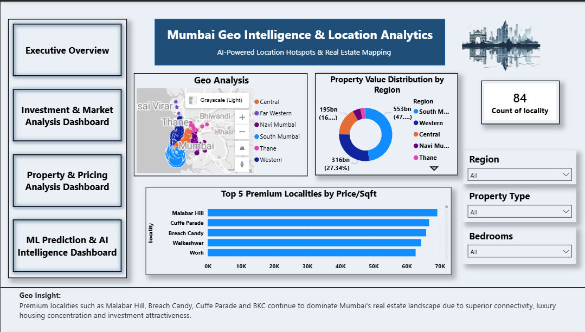
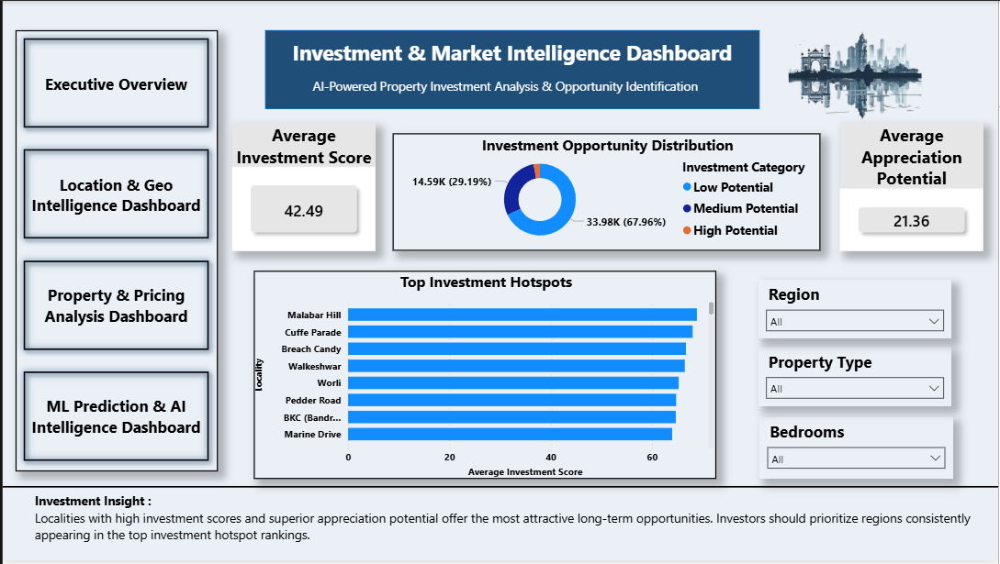
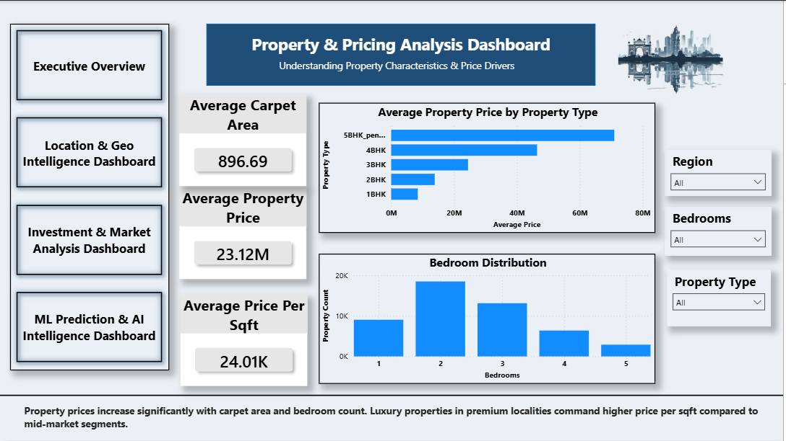
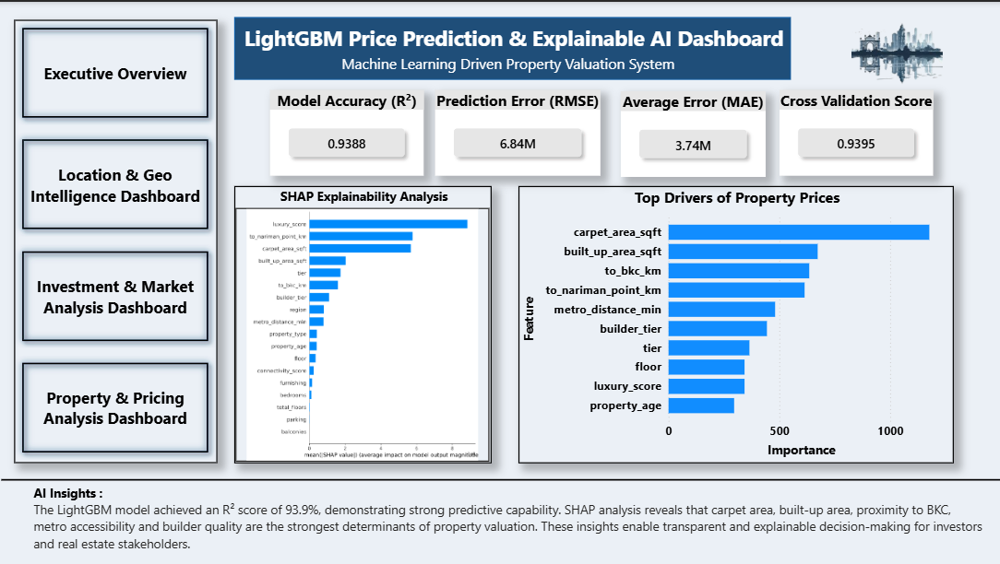

# 🤖 Machine Learning Pipeline

Model Used:

- LightGBM Regressor

Target:

- Property Price (INR)

Features:

- Region
- Property Type
- Bedrooms
- Carpet Area
- Built-up Area
- Floor
- Furnishing
- Builder Tier
- Metro Distance
- Connectivity Score
- Luxury Score

Model predicts the expected market value of a property in Mumbai.

# 🧠 Explainable AI (SHAP)

One major challenge in real estate valuation is understanding:

"Why did the model predict this price?"

To solve this problem, SHAP (SHapley Additive Explanations) was integrated.

SHAP helps identify:

- Which features increase property value
- Which features decrease property value
- Relative contribution of each feature
- Model transparency for users

## SHAP Feature Importance

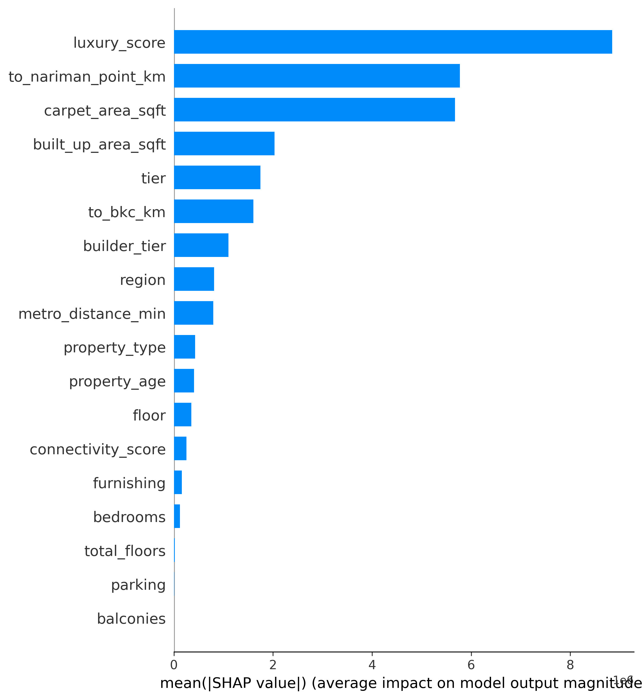

## SHAP Summary Plot

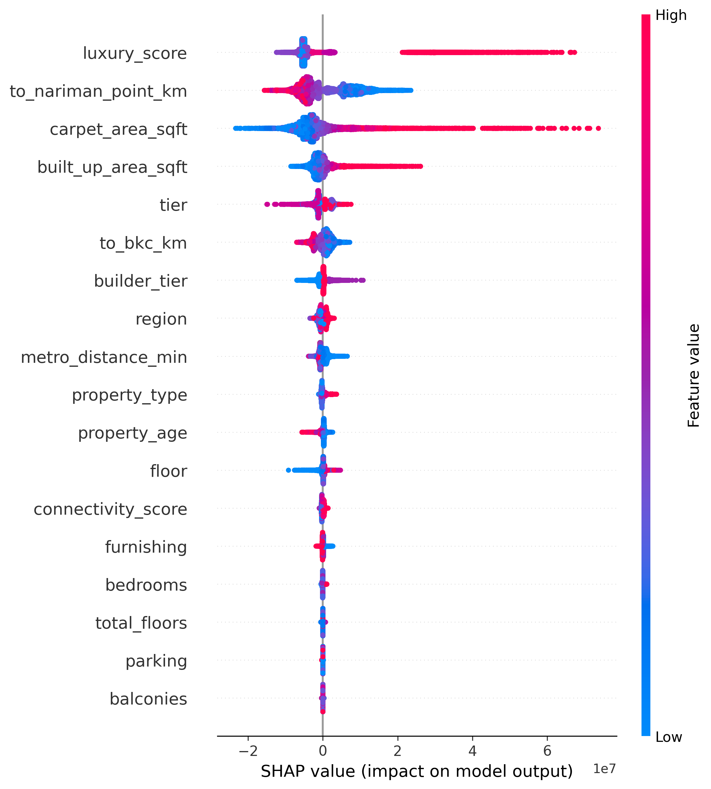

Key Insights:

- Carpet Area has the strongest impact on price.
- Luxury Score significantly influences valuation.
- Connectivity improves property attractiveness.
- Metro accessibility positively affects pricing.
- Property age reduces estimated value.

This provides transparency and trust in predictions.

# 🎯 Investment Recommendation Engine

A recommendation engine was developed to suggest suitable investment localities.

Inputs:

- User Budget
- Predicted Property Value
- Locality Investment Score

Output:

- Top Investment Localities
- Average Price
- Luxury Score
- Investment Score

This allows users to discover areas offering strong investment potential.

# 🤖 AI Real Estate Assistant

The project includes a local AI Assistant capable of answering:

- Should I invest in Powai?
- Is Bandra West expensive?
- Tell me about Worli.
- Which locality has better investment potential?

The assistant retrieves locality intelligence from the analytics dataset.

# 🚧 Challenges Faced

### 1. Data Quality Issues

Real estate data contained:

- Missing values
- Duplicate records
- Inconsistent locality names

Solution:

- Data cleaning pipeline
- Standardization techniques

---

### 2. Feature Engineering

Creating meaningful features from raw property data was challenging.

Solution:

- Distance metrics
- Luxury scoring
- Connectivity scoring

---

### 3. Model Explainability

Users needed transparency behind predictions.

Solution:

- SHAP Explainability Integration

---

### 4. Dashboard Integration

Combining:

- Machine Learning
- Streamlit
- Power BI
- AI Assistant

into one platform required modular architecture.

---

### 5. Recommendation Logic

Balancing:

- Investment Score
- Budget Constraints
- Locality Ranking

required multiple iterations.

# 💻 Technology Stack

## Machine Learning

- Python
- Pandas
- NumPy
- Scikit-Learn
- LightGBM
- SHAP

## Dashboard

- Streamlit
- Plotly

## Business Intelligence

- Power BI

## AI Components

- Ollama
- FAISS
- Sentence Transformers

## Visualization

- Matplotlib
- Seaborn

## ⚙️ Local Setup & Installation

# Clone the repository

git clone https://github.com/Faraz-05/Mumbai-Real-Estate-Intelligence-Platform.git

# Navigate to project directory

cd Mumbai-Real-Estate-Intelligence-Platform

# Create virtual environment

python -m venv venv

# Activate virtual environment

# Windows
venv\Scripts\activate

# Linux / Mac
source venv/bin/activate

# Install dependencies

pip install -r requirements.txt

# Run Streamlit application

streamlit run app/main.py

## 📂 Project Structure

```text
Mumbai-Real-Estate-Intelligence-Platform/
│
├── app/
│   ├── chatbot/
│   │   ├── prediction_engine.py
│   │   ├── explainability_engine.py
│   │   ├── recommendation_engine.py
│   │   ├── data_engine.py
│   │   ├── query_router.py
│   │   ├── locality_extractor.py
│   │   └── llm_engine.py
│   │
│   ├── data/
│   │   ├── investment_analysis.csv
│   │   ├── locality_analysis.csv
│   │   ├── geo_analysis.csv
│   │   └── kpi_data.csv
│   │
│   ├── tests/
│   │   ├── test_prediction.py
│   │   ├── test_recommendation.py
│   │   ├── test_shap.py
│   │   └── other unit tests
│   │
│   └── main.py
│
├── data/
│   ├── raw/
│   │   ├── secondary_sales.csv
│   │   ├── rentals.csv
│   │   ├── metro_stations.csv
│   │   └── under_construction.csv
│   │
│   └── processed/
│       ├── secondary_sales_cleaned.csv
│       └── under_construction_cleaned.csv
│
├── models/
│   ├── final_lightgbm_model.pkl
│   ├── final_xgboost_model.pkl
│   ├── final_random_forest_model.pkl
│   └── label_encoders.pkl
│
├── dashboard/
│   └── Mumbai_Real_Estate_Intelligence_Platform.pbix
│
├── dashboard_data/
│   ├── investment_analysis.csv
│   ├── locality_analysis.csv
│   ├── geo_analysis.csv
│   └── kpi_data.csv
│
├── reports/
│   ├── shap_bar.png
│   └── shap_summary.png
│
├── visuals/
│   ├── Executive_overview.png
│   ├── Investment_Analysis.png
│   ├── Location_Geo_Analysis.png
│   ├── ML_Prediction_AI.png
│   ├── market_kpi.png
│   ├── property_price_prediction1.png
│   ├── property_price_prediction2.png
│   ├── property_price_prediction3.png
│   ├── ai_chatbot.png
│   ├── shap_bar.png
│   └── shap_summary.png
│
├── notebooks/
│   ├── 01_data_cleaning.ipynb
│   ├── 02_feature_engineering.ipynb
│   ├── 03_model_training.ipynb
│   └── 04_powerbi_dataset_creation.ipynb
│
├── README.md
├── requirements.txt
└── .gitignore
```

## 📁 Folder Description

| Folder | Purpose |
|----------|----------|
| `app/` | Main Streamlit application and AI modules |
| `chatbot/` | Prediction, Explainability, Recommendation and AI Assistant logic |
| `data/` | Raw and processed Mumbai real estate datasets |
| `models/` | Trained Machine Learning models and encoders |
| `dashboard/` | Power BI dashboard source file |
| `dashboard_data/` | Datasets used for Power BI visualizations |
| `reports/` | SHAP Explainability visualizations |
| `visuals/` | Screenshots used in README and project documentation |
| `notebooks/` | Complete data science workflow from preprocessing to model training |
| `tests/` | Unit tests for validation and model verification |

## 📊 Interactive Power BI Dashboard

Explore the complete interactive dashboard here:

🔗 Power BI Report:
https://app.powerbi.com/links/7UxEQBbDjd?ctid=c274dbc2-fb53-4037-8d76-f7f8315c5ff2&pbi_source=linkShare

The dashboard includes:
- Executive Overview
- Investment Analytics
- Property Pricing Analysis
- Geo-Spatial Analysis
- Market KPI Tracking
- Hotspot Detection

⭐ Support This Project
If you found this project useful or learned something from it, consider giving it a star on GitHub.

⭐ Star the repository:
https://github.com/Faraz-05/Mumbai-Real-Estate-Intelligence-Platform

# 🔮 Future Scope

- RAG-based AI Assistant
- Real-Time Property Listings
- Rental Price Prediction
- Interactive Map Visualization
- Property Comparison Engine
- Personalized Investment Portfolios
- Cloud Deployment on AWS

# 👨‍💻 Author

Faraz Kazi

Artificial Intelligence & Data Science Engineer

Skills:

- Data Science
- Machine Learning
- Explainable AI
- Power BI
- Python Development

GitHub:
https://github.com/Faraz-05

LinkedIn:
(www.linkedin.com/in/farazkazi)
